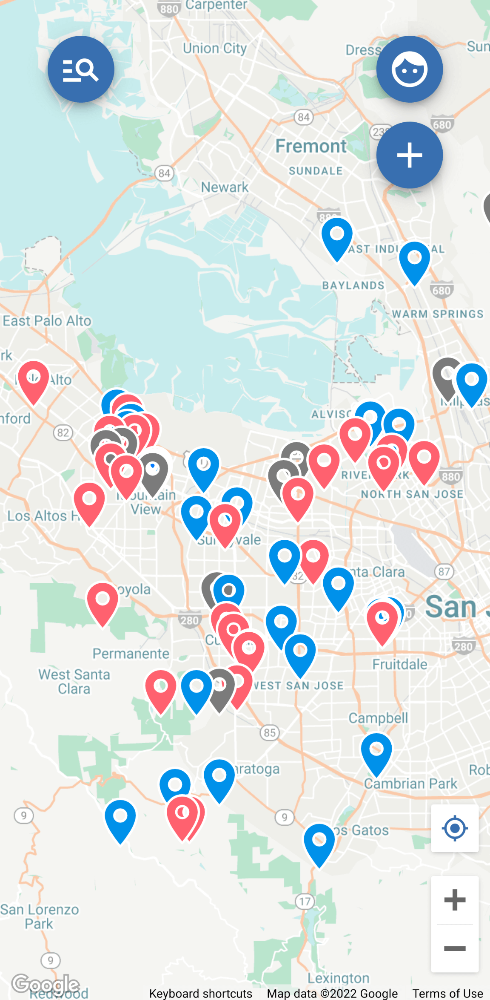
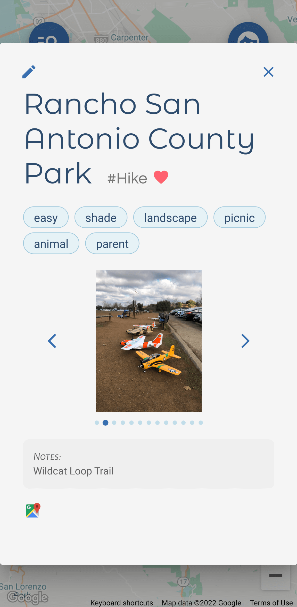
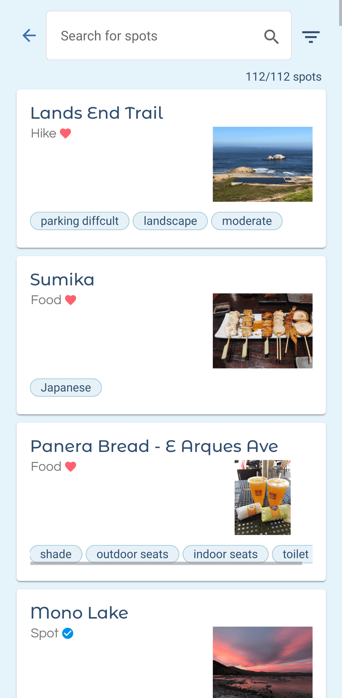
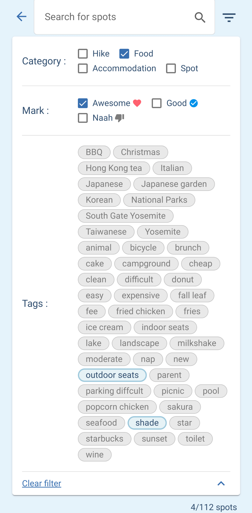

<h1 align="center">
  
  <h4 align="center" style="font-size: 16px; color: #888">
    Save and organize your personal places
  </h4>
</h1>

  
  
  
  

## Features

- Login / sign up.
- Add and save markers to the map.
  - Add name, descriptions, select category and icons, and add custom tags.
  - Upload photos, set photos sort orders.
  - Edit / delete saved markers.
- Show current device location on map, and center map to current location.
- View saved markers in list view.
  - Search and filter by name, category, icon, or tags.
  - Click to pan the map to the marker.
- Responsive, works on both desktop browsers and mobile phones.

## Built with

- TypeScript (frontend language)
- Angular (frontend framework)
  - Angular Material (UI library)
- Google Maps API
  - Embedded Maps Component (for embedded map and markers)
  - Google Places API Autocomplete (for searching places autocomplete)
- Firebase
  - Auth (login / sign up)
  - Firestore (primary database, stores user data)
  - Storage (storing user-uploaded images)
  - Cloud Functions (server-side operations such as batched DB operations and optimizing images)
- Sass (CSS preprocessor)
- Netlify
  - CDN hosting (hosting all frontend static assets)
  - CD (automatically builds and deploys on every git push)
- Circle CI
  - firebase security rules unit tests (automatically runs unit tests on every git push)
  - deploys firebase security rules (automatically deploys to firebase on every git push)

